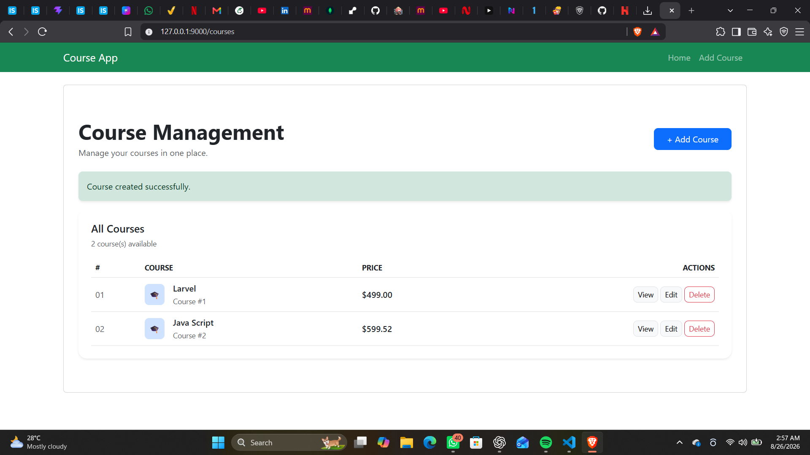
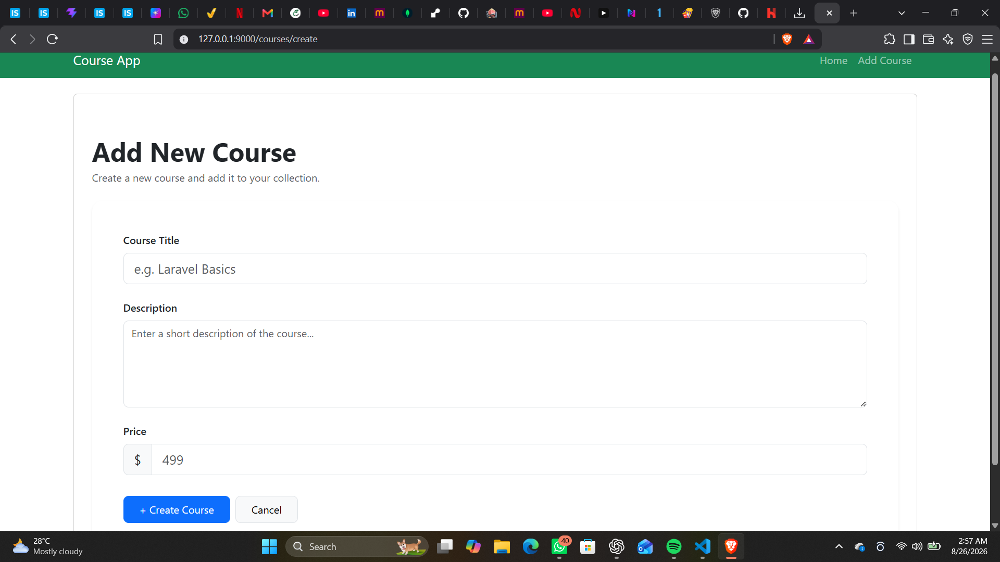
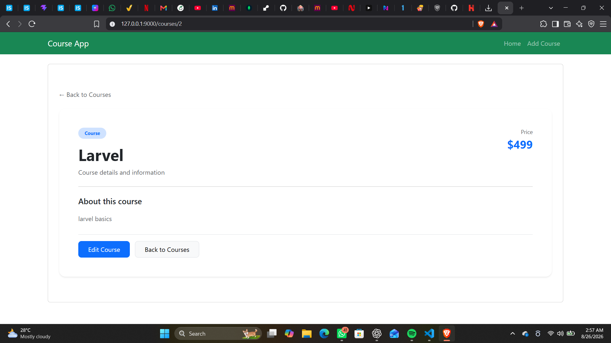

# Laravel Course Management System

A simple and responsive Course Management System built with Laravel. This project demonstrates CRUD operations using Laravel, Blade templates, routing, controllers, and database integration.

## 📸 Screenshots

### Course List



### Create Course



### Edit Course



## ✨ Features

- Create new courses
- View course details
- Edit existing courses
- Delete courses
- Add course title, description, and price
- Success messages after creating and updating courses
- Delete confirmation
- Clean and responsive user interface

## 🛠️ Tech Stack

- PHP
- Laravel
- Blade
- Bootstrap
- SQLite / MySQL
- HTML & CSS
- Git & GitHub

## 📂 Project Structure

```text
laravel12-crud/
│
├── app/
│   └── Http/
│       └── Controllers/
│           └── CourseController.php
│
├── database/
│   └── migrations/
│
├── resources/
│   └── views/
│       ├── courses/
│       │   ├── index.blade.php
│       │   ├── create.blade.php
│       │   ├── edit.blade.php
│       │   └── show.blade.php
│       │
│       └── layouts/
│           └── app.blade.php
│
├── routes/
│   └── web.php
│
├── screenshots/
│   ├── courses.png
│   ├── create-course.png
│   └── edit-course.png
│
└── README.md
```

## 🚀 Installation

### 1. Clone the repository

```bash
git clone https://github.com/saniakahnn/laravel-crud-project.git
```

### 2. Navigate to the project

```bash
cd laravel-crud-project
```

### 3. Install PHP dependencies

```bash
composer install
```

### 4. Install frontend dependencies

```bash
npm install
```

### 5. Create the environment file

```bash
cp .env.example .env
```

### 6. Generate the application key

```bash
php artisan key:generate
```

### 7. Configure the database

Update the database settings in the `.env` file.

Then run the migrations:

```bash
php artisan migrate
```

## ▶️ Run the Project

Start the Laravel development server:

```bash
php artisan serve
```

Open the application in your browser:

```text
http://127.0.0.1:8000/courses
```

## 🔄 CRUD Operations

| Operation | Description |
|---|---|
| Create | Add a new course |
| Read | View all courses and individual course details |
| Update | Edit course information |
| Delete | Remove a course |

## 🎯 Project Purpose

This project was built to practice Laravel fundamentals and understand how CRUD applications are developed using the MVC architecture.

It covers:

- Laravel routing
- Controllers
- Models
- Database migrations
- Blade templates
- Form handling
- CRUD operations
- Request validation
- Bootstrap UI
- Git and GitHub

## 🔮 Future Improvements

- User authentication
- Course categories
- Search and filtering
- Pagination
- Course images
- Improved validation
- REST API integration
- Admin dashboard

## 👩‍💻 Author

**Sania Khan**

Built with Laravel ❤️